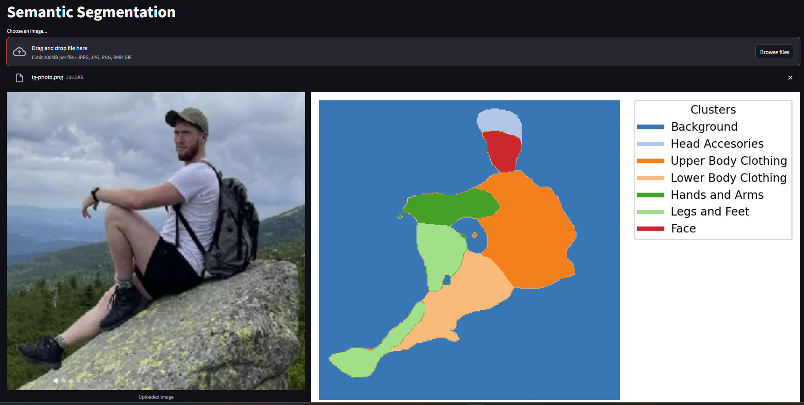
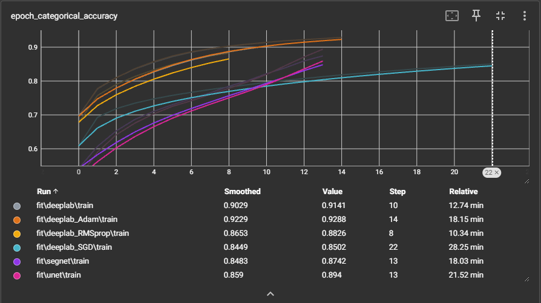
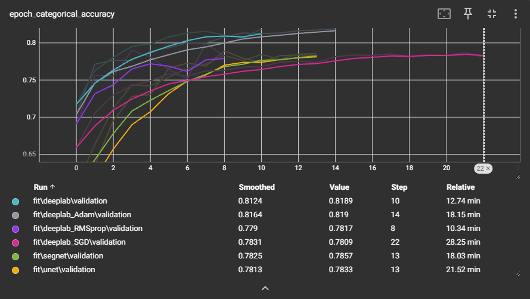

# Semantic Segmentation Project

This project focuses on semantic segmentation using various deep learning models. The dataset used is the LIP dataset, which contains images and annotations for semantic segmentation tasks.

## Dataset

- **Dataset URL**: [LIP Dataset](https://paperswithcode.com/dataset/lip)

### Simplified Dataset

We simplified the dataset by clustering similar classes together. The clusters are defined as follows:

```python
CLASSES_CLUSTERS = {
    0: [0],                 # Background
    1: [1, 2, 4],           # Head Accessories (Hat, Hair, Sunglasses)
    2: [5, 6, 7, 11],       # Upper Body Clothing (UpperClothes, Dress, Coat, Scarf)
    3: [9, 10, 12],         # Lower Body Clothing (Pants, Skirt, Jumpsuits)
    4: [14, 15, 3],         # Hands and Arms (Left-arm, Right-arm, Glove)
    5: [8, 16, 17, 18, 19], # Legs and Feet (Socks, Left-leg, Right-leg, Left-shoe, Right-shoe)
    6: [13]                 # Face
}

CLUSTERS_LABELS = {
    0: "Background",
    1: "Head Accessories",
    2: "Upper Body Clothing",
    3: "Lower Body Clothing",
    4: "Hands and Arms",
    5: "Legs and Feet",
    6: "Face"
}
```

## Setup
Run in project root

1. **Install required packages**:
    ```python
    pip install -r ./requirements.txt
    ```

2. **Download the dataset**:
    - **Setup Credential for DVC**: dvc remote modify --local myremote credentialpath 'path/to/project-XXX.json'
    - **Pull Data from DVC**: dvc pull


## Usage
All of these classes and scripts are implemented and shown in [main.ipynb](main.ipynb)
### Data Loading

The `DataLoader` class is used to load images and annotations for training and validation.

```python
train_gen = DataLoader("train")
val_gen = DataLoader("val")
```

### Model Training

The `Predictor` class is used to compile, train, and save models.

```python
predictor = Predictor(train_gen, val_gen)
predictor.add_model("deeplab", get_deeplab_model(input_shape=(*TARGET_SIZE, 3), num_classes=SEMANTIC_CLASSES))
```

### Model Evaluation

Load a trained model and make predictions on test images.

```python
predictor.load_model("deeplab")
test_img = load_img(os.path.join(test_dir, test_files_names[instance_number]), target_size=TARGET_SIZE)
test_img = img_to_array(test_img)
imshow(test_img)
prediction = predictor.predict("deeplab", test_img)
imshow(prediction, variant="annotation")
```

## Streamlit

To run the Streamlit app, follow these steps:

1. **Run the Streamlit app**:
    ```sh
    streamlit run app.py
    ```

This will start a local server and open the Streamlit app in your default web browser.

### Example usage:



## Results

We tested a few architectures (Unet, Segnet, Deeplab) and for the best (Deeplab), we tested a few optimizers (Adam, RMSprop, and SGD). The best results were achieved with Deeplab using the Adam optimizer, which obtained an accuracy of 0.819 on the validation data.

The training and validation results are logged and visualized using `train_logs` and `val_logs` images. These logs provide insights into the model's performance over epochs.

### Training Logs

The `train_logs` image shows the training accuracy over each epoch, helping to understand how well the model is learning from the training data.



### Validation Logs

The `val_logs` image displays the validation accuracy over each epoch, which is crucial for monitoring the model's performance on unseen data and detecting overfitting.

